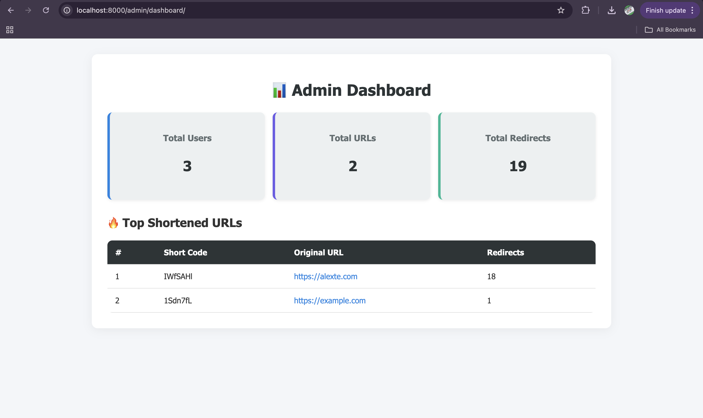

# ✂️ TinyLink – The URL Shortener Backend (Made with ❤️ by Kuldeep)

> **Shrink it. Track it. Secure it.**  
> A blazing-fast, scalable Node.js + TypeScript backend boilerplate for shortening URLs, now with JWT authentication built-in!

<p align="center">
  
  
</p>

---

## 🙏 Acknowledgements (Before you go further, please read this)

This project was heavily inspired by the great structure and clarity of [@a7urag](https://github.com/a7urag)'s repository:

- ⭐️ [`node-express-mysql-typescript-api-boilerplate`](https://github.com/a7urag/node-express-mysql-typescript-api-boilerplate)

A huge thanks for setting such a great reference point for writing clean, scalable backend architecture using TypeScript, Express, and TypeORM.

## ✨ Why TinyLink?

Because long URLs are boring.

This project gives you a ready-to-roll backend for a URL shortener service, including:

- 🔐 JWT-authenticated user login & registration
- 🔗 URL shortening with unique short codes
- 🚀 Instant redirect support
- 🎯 Production-ready structure (TypeORM, PM2, etc.)

---

<br />

## 🔗 URL Shortening Strategy: KGS (Key Generation Service)

### ✅ Why We Chose the KGS Approach

Our URL shortener uses the **Key Generation Service (KGS)** technique to create short, unique codes for long URLs. After reading throughly article for techniques like Base62 counters, MD5 hashing, and random generation, I chose KGS for its **simplicity, high performance, and scalability**.

This decision is inspired by the excellent system design breakdown in this Medium article:
👉 [Scalable URL Shortener System Design – by Sandeep Verma](https://medium.com/@sandeep4.verma/system-design-scalable-url-shortener-service-like-tinyurl-106f30f23a82)

---

### 🧠 What is KGS?

KGS is a service responsible for **pre-generating a large pool of unique short keys** (e.g., 7-character Base62 strings like `a9ZxP1Q`) and storing them in a database. Whenever a new URL needs to be shortened, an unused key is picked, marked as used, and mapped to the long URL.

---

### 📊 Comparison with Other Techniques

| Technique             | Pros                                               | Cons                                                        |
| --------------------- | -------------------------------------------------- | ----------------------------------------------------------- |
| **Base62 Counter**    | Simple, deterministic                              | Requires coordination and partitioning in distributed setup |
| **MD5 Hashing**       | Easy to implement, no extra counter or key service | Hash collisions possible; retry logic needed                |
| **Random Generation** | No need for counter or hash                        | Frequent DB lookups for collision detection                 |
| **🔑 KGS (Our Pick)** | Fast, collision-free, easy to scale                | Needs upfront key generation and duplicate handling         |

---

### 🚀 Why KGS?

- ✅ **No Collisions:** Keys are unique and pre-validated.
- ⚡ **Fast:** No need to check DB repeatedly for duplicates.
- 📦 **Cache Friendly:** Frequently used short URLs can be cached (e.g., using Redis).
- 🧩 **Custom Alias Support:** Easily handles custom user-defined short codes (up to 16 characters).
- 🔄 **Concurrency Safe:** Can be designed with locking or atomic marking.

---

### 🛠️ How Our KGS Works

Please go through above medium article link

---

## 🏗️ Built With

- ⚡ [Express](https://expressjs.com/) – Fast, unopinionated web framework
- 🧙 [TypeScript](https://www.typescriptlang.org/) – Strongly-typed JavaScript
- 🧱 [TypeORM](https://typeorm.io/) – Elegant TypeScript ORM
- 🔐 [jsonwebtoken](https://github.com/auth0/node-jsonwebtoken) – JWT-based auth
- 🧠 Designed and developed by **Kuldeep**

---

## 🔑 Environment Variables

Create a `.env` file in the root directory and add the following variables:

`PORT:`whatever you prefer but not 3000(it doesn't suit us 😆)

`JWT_SECRET:` your_super_secret_key

`DATABASE_URL:` postgres neon link

`NODE_ENV:` development or production

<br />

## 🚀 Getting Started

```
clone the repository
run `yarn run init-db` (for initialize the tables)
run `yarn run generate-keys` (it will generate all keys to be use for short urls)
run `yarn run truncate-db` (it will clean all the data inside the tables)
yarn install
yarn watch-ts
```

<br />

## 🏭 Production

```
# Compile TypeScript
yarn build

# Run the app
yarn start

```

## 🧯 For Test Cases

```
yarn test
```

## 🧑‍💼 Admin Dashboard

`call /admin/dashboard`



## 🔌 Available APIs

    🔌 For Available APIs


    | Method | Endpoint                | Description                    |
    |--------|-------------------------|--------------------------------|
    | POST   | `/api/user/auth/register` | Register a new user & token    |
    | POST   | `/api/user/auth/login`    | Login & get JWT token          |

    ✂️ URL Shortening

    | Method | Endpoint                    | Description                                         |
    |--------|-----------------------------|-----------------------------------------------------|
    | POST   | `/api/url/shorten`          | Shorten a URL (JWT required)                        |
    | GET    | `/api/url/:code`            | Redirect to the original long URL                  |
    | GET    | `/api/url/analytics/:code`  | 📊 Get analytics data for a short URL (JWT required) |

<br />

## 🧪 Postman Collection

[](https://app.getpostman.com/run-collection/30468072-686ea2ac-4690-4e0a-9753-e271e3b83d83?action=collection%2Ffork&source=rip_markdown&collection-url=entityId%3D30468072-686ea2ac-4690-4e0a-9753-e271e3b83d83%26entityType%3Dcollection%26workspaceId%3D23332451-5340-436e-84ab-8730f0cfa214)

## ✅ TODO

<ul>
  <li>✅ JWT-based user authentication (Register + Login)</li>
  <li>✅ Secure URL shortening with unique codes</li>
  <li>✅ Public redirection endpoint</li>
  <li>✅ Click analytics (track total hits)</li>
  <li>✅ Custom alias support for short codes</li>
  <li>✅ Add Rate Limiting for prevent the attacks and for both users authenticated and anonymous</li>
  <li>✅ Redis-based caching for faster redirects</li>
  <li>✅ Docker setup</li>
  <li>✅ Admin Dashboard</li>
  <li>✅ Test cases</li>
  <li>✅ GitHub Action for CI/CD setup</li>
</ul>

✅ = Completed
⬜ = Pending

<br />

## 🧙 Author

Made with ❤️ by Kuldeep

“A great URL doesn't need to be long — just smart.” 🔗✨
